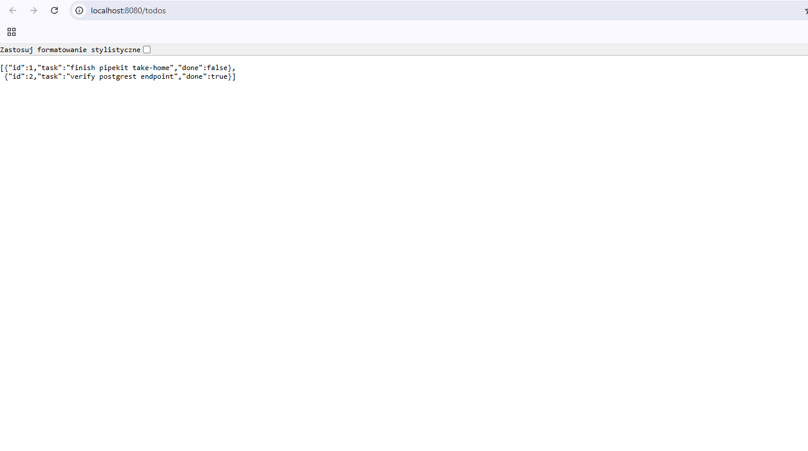

# Pipekit Infra Take-home

This repository contains my solution for the Pipekit infrastructure take-home exercise.

## Prerequisites

The following tools must be installed:

- Docker
- k3d
- kubectl
- Terraform or OpenTofu
- git

## Clone the repository

```bash
git clone <your-repo-url>
cd <repo>/tofu
terraform init
terraform apply

Might need to rollout deployment:
kubectl rollout restart deployment/postgrest -n postgrest
Open the API endpoint in your browser:

http://localhost:8080/todos

you should see the injected data:

